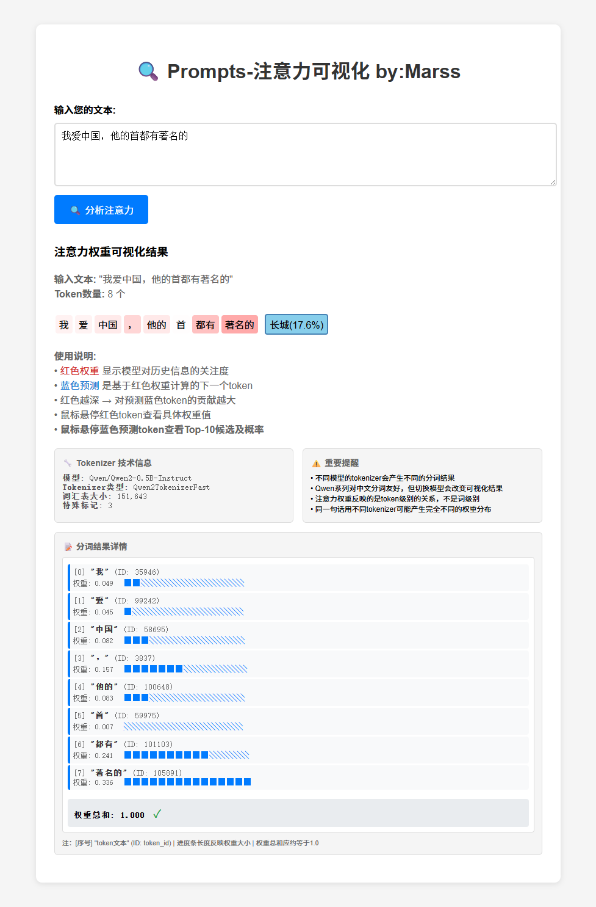

# 🔍 Attention Visualizer - 注意力可视化工具

> **交互式Transformer注意力权重可视化 + 预测分析工具**
>
> 通过Web界面实时分析模型的注意力分布和下一token预测，理解AI如何"关注"输入文本并做出预测决策

## 📸 效果展示



*实际运行效果：输入你的提示词（也可以加上模型正在的输出）"我爱中国，他的首都在于"，展示了详细的token级别注意力权重分布，包括token ID、权重数值和可视化进度条*

## ✨ 功能特性

### 🎯 核心功能
- **实时注意力可视化** - 输入文本，立即看到注意力权重分布
- **下一token预测** - 显示模型预测的下一个token及概率
- **Top-K候选展示** - 悬停预测token查看前10个候选及概率

### 🌐 交互体验
- **现代化Web界面** - 支持快捷键和实时分析
- **因果关系展示** - 红色注意力权重 → 蓝色预测token的视觉流向
- **智能悬停提示** - 鼠标悬停查看详细信息

### 📊 技术深度
- **科学准确** - 基于Transformer最后一层的真实注意力权重
- **完整技术信息** - tokenizer详情、权重统计、分词结果
- **概率分布保真** - 保持原始softmax概率，不做归一化失真

## 🚀 快速开始

### 环境要求
- Python 3.8+
- 支持CUDA的GPU（推荐）

### 安装依赖
```bash
# 使用uv包管理器（推荐）
uv add torch transformers flask modelscope

# 或使用pip
pip install torch transformers flask modelscope
```

### 启动应用
```bash
python app.py
```

然后访问：http://localhost:5000

## 🎮 使用方法

1. **启动服务** - 运行 `python app.py`
2. **输入文本** - 在网页中输入要分析的中文文本
3. **观察注意力** - 红色深浅表示模型对各token的关注度
4. **查看预测** - 蓝色token显示模型预测的下一个token及概率
5. **探索候选** - 鼠标悬停蓝色预测token查看Top-10候选列表
6. **技术分析** - 查看tokenizer信息和详细的权重统计

### 💡 交互技巧
- 鼠标悬停红色token → 查看精确注意力权重
- 鼠标悬停蓝色预测token → 查看Top-10候选及概率
- 使用Ctrl+Enter快捷键提交分析


## 🔬 技术原理

### 注意力-预测链分析
本工具实现了完整的**注意力→预测**因果链分析：

```python
# 1. 注意力权重提取（因果注意力的正确方法）
attention = outputs.attentions[-1]  # [batch, heads, seq_len, seq_len]
averaged = attention.mean(dim=1)    # [batch, seq_len, seq_len]
last_token_attention = averaged[0, -1, :]  # [seq_len]

# 2. 下一token预测（从同一次前向传播获取）
logits = outputs.logits[0, -1, :]  # 最后位置的预测分数
probs = torch.softmax(logits, dim=-1)  # 转换为概率分布

# 3. Top-K候选提取
top_probs, top_token_ids = torch.topk(probs, 10)
```

### 因果关系可视化
- **红色权重** - 模型基于注意力机制对历史信息的关注分布
- **蓝色预测** - 基于红色注意力权重计算出的下一token预测
- **视觉流向** - 清晰展示"注意力如何影响预测"的因果关系

## 📁 项目结构

```
├── app.py                                # Web交互式界面（主要功能）
├── specs/
│   ├── attention-visualizer/             # 注意力可视化规范文档
│   └── attention-prediction-chain/       # 注意力预测链规范文档
│       ├── task-list.md                 # 功能开发任务清单
│       └── requirements.md              # 需求规格说明
├── CLAUDE.md                            # Claude Code配置文件
├── pyproject.toml                       # Python项目配置（uv管理依赖）
└── README.md                           # 项目文档（本文件）
```

## 🎯 支持的模型

目前支持基于Transformer架构的模型：

- ✅ **Qwen系列** - Qwen2-0.5B-Instruct（默认）
- ✅ **其他Transformer模型** - 只要支持 `output_attentions=True`

### 模型切换
```python
# 在 app.py 中修改模型名称
model_name = "你的模型名称"
```

## 🔧 高级功能

### 注意力分析
- **权重可视化** - 红色深浅表示注意力强度
- **技术信息** - 模型信息、词汇表大小、tokenizer类型
- **分词详情** - 完整的token分解过程和ID映射
- **权重统计** - 注意力权重分布验证

### 预测分析
- **下一token预测** - 显示最可能的下一个token及概率
- **Top-K候选** - 悬停显示前10个候选token及概率排序
- **概率分布** - 保持原始softmax概率的真实性
- **因果关系** - 视觉化展示注意力如何影响预测

### 交互体验
- **智能悬停** - 鼠标悬停查看详细信息
- **实时分析** - 即时计算和显示结果
- **快捷操作** - 支持Ctrl+Enter提交分析

## ⚠️ 重要提醒

1. **分词理解** - 不同模型的tokenizer会产生不同的分词结果
2. **权重解释** - 注意力权重反映的是token级别的关系，不是词级别
3. **模型限制** - 闭源API模型（如GPT-4）无法获取内部注意力权重
4. **计算资源** - 大型模型需要相应的GPU资源

## 🛠️ 开发历史

### V2.0 - 注意力预测链功能 ✅
- ✅ **下一token预测** - 显示模型预测的下一个token及概率
- ✅ **Top-K候选显示** - 悬停查看前10个候选token及概率
- ✅ **因果关系可视化** - 红色注意力权重→蓝色预测token的视觉流向
- ✅ **交互体验增强** - 智能tooltip和悬停提示
- ✅ **技术架构升级** - 使用AutoModelForCausalLM同时获取注意力和预测

### V1.0 - 基础注意力可视化 ✅
- ✅ **注意力计算逻辑修正** - 从错误的 `sum(dim=-2)` 改为正确的最后token注意力
- ✅ **权重归一化优化** - 移除不当的min-max归一化，保持概率分布性质
- ✅ **Web交互界面** - 实现现代化的实时可视化Web应用
- ✅ **中文支持优化** - 正确处理中文token的显示和编码

### 技术债务和改进空间
- [ ] 支持更多模型架构
- [ ] 特殊token显示优化
- [ ] 错误处理增强

## 🔮 未来功能

### 闭源模型支持
正在探索通过**输入重要性分析**支持闭源API：
```python
def analyze_input_importance_via_api(text, api_client):
    """通过遮蔽token分析重要性（伪注意力）"""
    # 1. 获取完整输出
    # 2. 逐个遮蔽token，观察输出变化
    # 3. 计算重要性分数
```

## 📄 许可证

MIT License - 自由使用和修改

## 🤝 贡献

欢迎提交Issue和Pull Request！

### 开发指南
1. Fork本项目
2. 创建feature分支
3. 提交变更
4. 发起Pull Request

## 📞 联系

- 项目维护者：Marss
- 联系邮箱：Seraphim999@163.com
- 技术问题：请提交GitHub Issue
- 功能建议：请提交GitHub Issue

---

**⭐ 如果这个工具对你有帮助，请给个Star支持一下！**