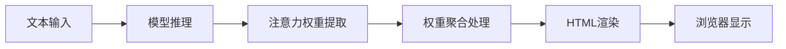
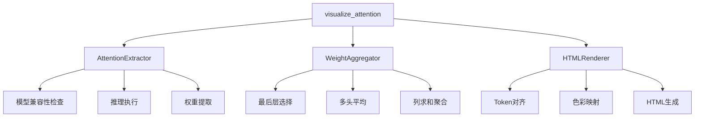

# 设计文档

## Overview

Attention Visualizer 是一个专门为提示词工程优化的注意力可视化工具。通过从 Hugging Face transformers 模型中提取注意力权重，并以HTML文本高亮形式呈现，帮助工程师直观理解模型对提示词不同部分的关注程度。

### 核心设计原则
1. **极简接口**：一个函数完成从模型到可视化的全流程
2. **聚焦实用性**：专注于提示词工程最需要的信息（每个token被关注程度）
3. **零配置**：使用合理默认值，避免参数选择困扰
4. **直观呈现**：文本高亮方式保持可读性的同时显示量化信息

## Architecture

### 整体数据流


### 核心组件架构


## Components and Interfaces

### 1. 主接口函数
```python
def visualize_attention(
    model,                    # 已加载的transformers模型
    tokenizer,               # 对应的tokenizer
    text: str,               # 输入文本
    output_path: str = "attention_viz.html",  # 输出HTML文件路径
    auto_open: bool = True,  # 是否自动在浏览器打开
    figsize: tuple = (12, 6) # HTML页面尺寸控制
) -> str:
    """
    从模型提取注意力权重并生成HTML可视化
    
    Returns:
        str: 生成的HTML文件路径
    """
```

### 2. AttentionExtractor 组件
```python
class AttentionExtractor:
    """负责从模型中提取注意力权重"""
    
    def extract(self, model, tokenizer, text) -> tuple:
        """
        Returns:
            tuple: (tokens, attention_weights, input_ids)
        """
        # 1. 检查模型兼容性
        # 2. 执行推理 output_attentions=True
        # 3. 提取最后一层注意力权重
```

### 3. WeightAggregator 组件  
```python
class WeightAggregator:
    """处理和聚合注意力权重"""
    
    def aggregate(self, attention_tensor) -> np.ndarray:
        """
        将 (batch, heads, seq_len, seq_len) 聚合为每个token的被关注度
        
        核心算法：
        1. 选择最后一层: attention[-1]
        2. 平均所有头: .mean(dim=1)  
        3. 按列求和: .sum(dim=-2) -> 每个token被关注的总权重
        
        Returns:
            np.ndarray: shape (seq_len,) 每个token的聚合注意力权重
        """
```

### 4. HTMLRenderer 组件
```python
class HTMLRenderer:
    """生成HTML可视化页面"""
    
    def render(self, tokens, weights, output_path) -> str:
        """
        生成带有文本高亮的HTML页面
        
        特性：
        - 使用红色深浅表示注意力强度
        - 响应式设计支持长文本
        - 内嵌样式确保单文件完整性
        - 包含权重数值的tooltip
        """
```

## Data Models

### 注意力数据流转
```python
# 1. 模型输出格式
ModelOutput = {
    'logits': torch.Tensor,
    'attentions': tuple[torch.Tensor, ...]  # 每层的注意力权重
}

# 2. 单层注意力张量
LayerAttention = torch.Tensor  # shape: (batch=1, heads, seq_len, seq_len)

# 3. 聚合后权重
TokenWeights = np.ndarray  # shape: (seq_len,) 每个token被关注程度

# 4. 渲染数据
VisualizationData = {
    'tokens': list[str],      # 分词结果
    'weights': np.ndarray,    # 归一化权重 [0,1]
    'colors': list[str],      # RGB颜色值
    'tooltips': list[str]     # 悬浮显示的详细信息
}
```

## Error Handling

### 错误分类和处理策略
```python
class AttentionVisualizationError(Exception):
    """基础异常类"""
    pass

class ModelCompatibilityError(AttentionVisualizationError):
    """模型不兼容错误"""
    # 处理：输出明确警告信息，提供解决建议

class AttentionExtractionError(AttentionVisualizationError):
    """注意力提取失败"""
    # 处理：检查output_attentions参数，提供调试信息

class RenderingError(AttentionVisualizationError):
    """HTML渲染错误"""  
    # 处理：提供备用渲染方案或简化输出
```

### 具体错误处理场景
1. **模型不支持注意力输出**
   - 检测：尝试推理时捕获异常
   - 响应：明确提示需要支持output_attentions的模型
   - 建议：推荐兼容的模型列表

2. **内存不足**
   - 检测：推理过程中的CUDA OOM
   - 响应：建议减少输入长度或使用CPU
   - 降级：提供低精度推理选项

3. **Token对齐问题**
   - 检测：tokens数量与attention维度不匹配
   - 响应：显示详细维度信息便于调试
   - 修复：智能截断或补齐

## Testing Strategy

### 单元测试覆盖
1. **AttentionExtractor测试**
   ```python
   def test_qwen_compatibility():
       # 测试Qwen系列模型的注意力提取
   
   def test_attention_shape_validation():
       # 验证输出张量形状正确性
   ```

2. **WeightAggregator测试**
   ```python
   def test_weight_aggregation():
       # 测试聚合算法正确性
   
   def test_normalization():
       # 验证权重归一化到[0,1]区间
   ```

3. **HTMLRenderer测试**
   ```python
   def test_html_generation():
       # 验证HTML结构正确性
   
   def test_color_mapping():
       # 测试权重到颜色的映射
   ```

### 集成测试场景
1. **端到端流程**：完整的模型→HTML流程测试
2. **多模型兼容性**：测试不同模型架构的支持
3. **长文本处理**：测试边界情况和性能

### 性能基准
- **目标响应时间**：< 10秒（包含模型推理）
- **内存使用**：监控大模型推理时的峰值内存
- **HTML文件大小**：控制在合理范围内

## Implementation Plan

### Phase 1: 核心功能 (P0)
1. 实现`AttentionExtractor`基础功能
2. 实现`WeightAggregator`聚合算法  
3. 实现`HTMLRenderer`基础渲染
4. 集成主接口函数
5. Qwen模型兼容性测试

### Phase 2: 增强功能 (P1)  
1. 多模型兼容性扩展
2. 错误处理和用户友好提示
3. 长文本优化和性能调优
4. 完整的单元测试覆盖

### Phase 3: 未来扩展 (P2)
1. Web应用版本设计和实现
2. 批量对比功能
3. 交互式增强特性

## Technical Notes

### 关键实现细节
1. **色彩映射算法**
   ```python
   # 使用matplotlib红色色谱
   import matplotlib.cm as cm
   colors = cm.Reds(normalized_weights)
   ```

2. **Token对齐处理**
   ```python
   # 处理subword tokenization显示
   tokens = tokenizer.convert_ids_to_tokens(input_ids)
   # 可能需要去除特殊前缀如"▁"或"##"
   ```

3. **HTML模板结构**
   - 使用内嵌CSS确保样式完整性
   - 响应式设计适配不同屏幕尺寸
   - 包含JavaScript增强交互体验（可选）

4. **性能优化策略**
   - 推理时仅启用必需的输出
   - 大张量处理后及时释放内存
   - HTML生成使用高效的字符串拼接